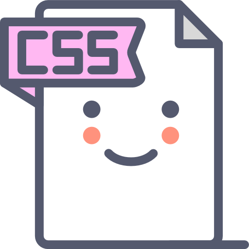

# Este Repositório tem o objetivo de expor os resultados dos estudos de CSS e CSS3.

## 🚨🚨🚨 Qual a diferença entre CSS e CSS3?

CSS  é a versão básica e não suporta design responsivo, enquanto CSS3 é a versão mais recente e suporta design responsivo, possui modules.

Existem muitas vantagens na nova versão do CSS3, irei demonstrar em cada projeto.

---
## Estrutura dos projetos:

    🪧 Páginas web estáticas:  

        * Receita_bolo;
        * barbearia;
    
    🪧 Páginas Web Autocontida:  

        * venda-livro

    🪧 Páginas Web Dinâmicas:  

        * Em construções, aguardem!!!!

Boas Práticas:

    * Arquitetura;
    * Identação;
    * Arquivo externo (pasta css na raiz do projeto) utilize <link rel="stylesheet" href="estilo.css">.

---
## Contato  

 
  
  

  

 
 

   

   
   
   

___

Developer🔸Nilva Pires 🔸2023

