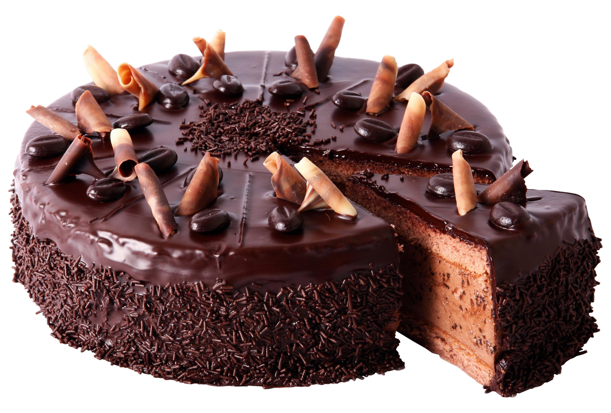

# Projeto Receita de bolo Chocolate

## Objetivo:
Página ESTÁTICA com link de contato.  

---
## Arquitetura da página web.

### Estrutura de Pasta:
---

    📁 Projeto-Receita de bolo
    |
    |- 📁 Receita_bolo
    |   |
    |   |- 📁 css
    |       |- 📑 style.css
    |   
    |- 📑 index.html
    |- 📑 readme.md
  

---
### Estrutura Html:

    📁 HTML
    |
    |- 📁 html
    |   |
    |   |- 📁 Head
    |       |- 📑 meta charset
    |       |- 📑 meta description
    |       |- 📑 meta viewport
    |       |- 📑 link css
    |       |- 📑 title
    |
    |- 📁 body
    |   |      
    |   |- 📁 div ( 1ª seção - página)
    |       |- 📑 h1
    |       |- 📑 h2
    |       |- 📑 img
    |    
    |
    |- 📁 div ( 2ª seção -  Descrição dos Ingredientes)
    |       |- 📑 h3
    |       |- 📑 p
    |       |- 📑 p
    |
    |- 📁 div ( 3ª seção - Modo de Fazer)
    |       |- 📑 h3
    |       |- 📑 p
    |       |- 📑 p
    |
   

## Tecnologia:

  

___

---
## Considerações:

      * Boa prática diz que o arquivo do CSS tem que ser externo, para isto crie uma pasta dentro da raiz do      
        projeto (conforme Arquitetura), para facilitar a manutenção da página Web.
      * Para acessar arquivo do CSS utilizei o link  <link rel="stylesheet" href="css/style.css"> dentro da TAG head, 
        observe o caminho que o html tem que percorrer para acessar o arquivo:
          * primeiro acessa a pasta css depois acessa o arquivo style.css  

          *  href="css/style.css"  

          * Sintaxe do código CSS é simples composto por:  

            elemento {
          propriedade: valor;
                    }

    * O elemento representa 01 TAG do html;
    * Chaves de abertura e fechamento {};
    * propriedade representa a caracteristica do elemento que será alterado(estilizado);
    * valor será relativo a propriedade e depende dela para ser definido ex: font-size: 28px -> 28px foi definido       
      como númerico;
    * ; ponto e virgula faz parte da continuidade de propriedades, seu uso é obrigatório quando for inserir mais 
        propriedade ao código. Será dispensado quando for um único valor dentro do código.

---
## Contato  

 
  
  

  

 
 

   

   
   
   

___  

Developer🔸Nilva Pires 🔸2023

