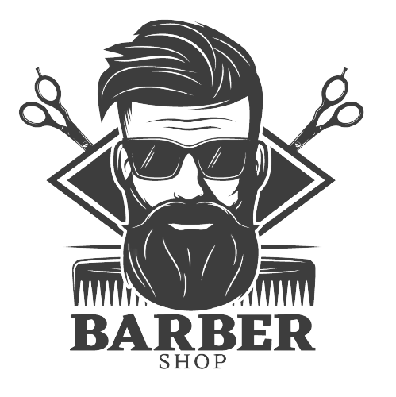

# Projeto Barbershop Star Club

---
## Arquitetura da página Web

### Tag's básicas aplicadas:
* HTML 
    * Versão 5
    * Imagem, Título, Subtítulos, parágrafos e link.
* CSS
    * Versão 3
    * Propriedades: width, border, border-radius, padding e margin.
   
### Considerações:
   
---
  Quer entrar contato comigo? Clique aqui
[Linkedin](www.linkedin.com/in/nilva-pires)

---
__Developer🔸Nilva Pires 🔸2023__